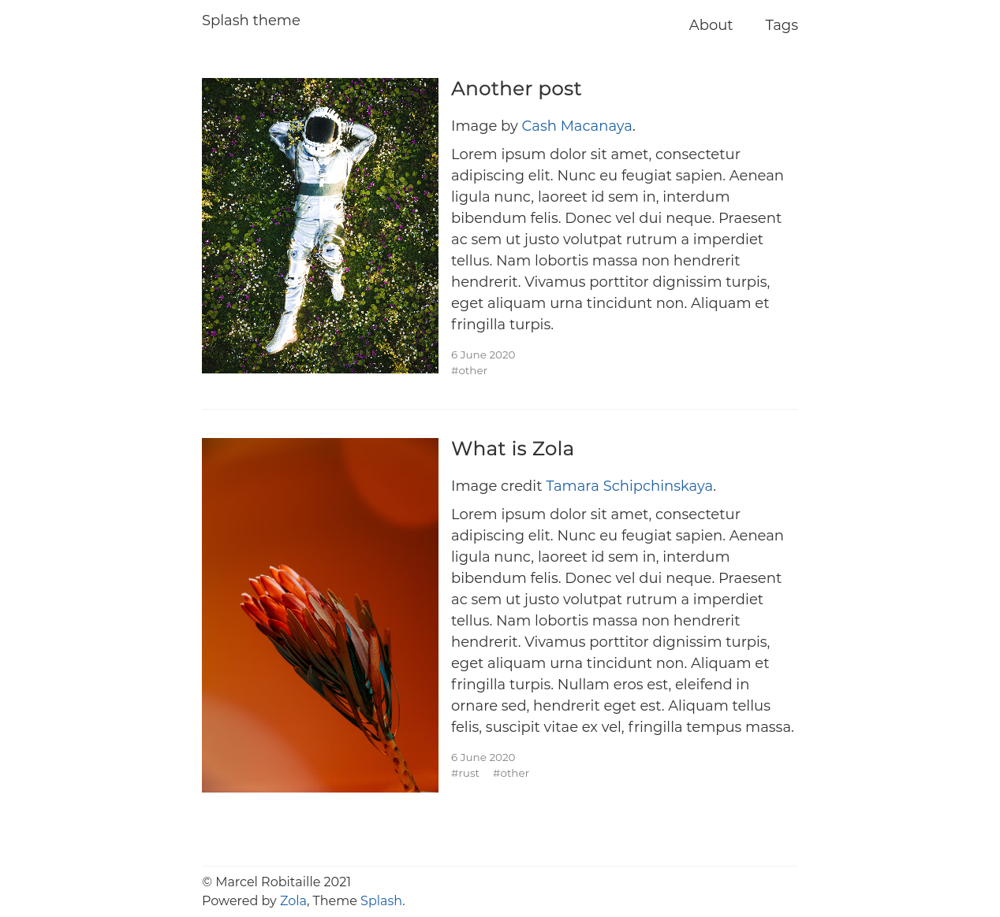

# Splash theme for Zola

This is a fork of the [Anpu](https://github.com/zbrox/anpu-zola-theme) theme for [Zola](https://getzola.org)
with the primary goal to add thumbnails for posts.



## Usage

In order to use the theme you need to clone this repository in your `themes` folder:

```bash
git clone https://github.com/MarcelRobitaille/zola-splash.git themes/splash
```

Then set your theme setting in `config.toml` to `splash`:

```toml
theme = "splash"
```

This theme requires both the `tags` and `categories` taxonomies.

```toml
taxonomies = [
    { name = "categories" },
    { name = "tags" },
]
```

## How To Customize

There are two things you can customize:

- The links to be included in the menu
- The date format of the posts

### Header images

The claim to fame of this fork is the thumbnail images.
To enable them, add the following to the front matter.

```toml
[extra]
header_image = "/path/to/image.jpg"
```

### Menu links

In your `config.toml` under the `[extra]` section you need to set the `splash_menu_links` list.

Example:

```toml
[extra]
splash_menu_links = [
    { url = "$BASE_URL/about/", name = "About" },
]
```

If you include `$BASE_URL` in the url of a link it will be replaced to the base url of your site.

### Date format

In your `config.toml` under the `[extra]` section you need to set the `splash_date_format` value.

Example:

```toml
[extra]
splash_date_format = "%e %B %Y"
```

The formatting uses the standart `date` filter in Tera. The date format options you can use are listed in the [chrono crate documentation](https://tera.netlify.app/docs/#date).

### Author

By default, the copyright at the bottom of the page will be to `config.title`.
Alternatively, you can specify `splash_author` for the copyright.

```toml
[extra]
splash_author = "Marcel Robitaille"
```
